# Architecture

```mermaid
flowchart LR
  U[Authenticated user: item + budget + recipient] --> C[Immutable SQLite consent]
  C --> A[Bounded commerce agent]
  M[Untrusted merchant description] --> A
  A --> P[Untrusted payment proposal]
  C --> F[Independent deterministic firewall]
  P --> F
  F -->|BLOCK| D[Denied + durable audit]
  F -->|REVIEW| H[Authenticated human operator]
  H -->|approved within original consent| G[Payment eligibility gate]
  F -->|ALLOW| G
  G --> O[PayPal Sandbox create order]
  O --> B[Sandbox buyer approval]
  B --> V[GET order + verify item, payee, price, references]
  V --> X[Idempotent capture + GET completed evidence]
  X --> L[Durable transaction history]
```

## Trust and authority

Original structured consent is issued from an authenticated user action. The
instruction is recorded for provenance; item, budget, automatic limit and
recipient form the enforceable grant. Server policy supplies merchant, currency,
maximum limits, recipient and catalog price. Unstructured natural language is
not parsed as authority. The UI explicitly presents the structured boundaries.

Consent is immutable via SQLite triggers. A UNIQUE authorization ID on intents
reserves it once before any model call. Retries return that same record. A model
failure or interrupted run stays denied; a new explicit grant is needed to
retry an interrupted model workflow. A pending run cannot execute a payment.

The model has only `read_catalog` and `propose_payment`. It can read one selected
record and propose once; at most four provider calls are allowed. Every tool
name/argument is checked on the server. No arbitrary URLs, network fetches,
code execution, policy changes, review or payment tools are exposed. The server
independently checks the proposal; even a fully compromised model has no payment
authority. Explanations are separately marked as unverified model output.

## Persistence and payment state

SQLite WAL with FULL synchronous writes and transactions stores authorizations,
intents and audit events. Triggers reject authorization and audit updates/deletes.
Audit is application append-only, not cryptographically tamper-proof against a
database/OS administrator. Original instructions and bounded explanations are
stored; secrets, raw API responses, payer profiles and provider tokens are not.

Each intent has independent persisted UUIDs for create and capture. A transactional
180-second lease excludes overlapping operations even across connections to the
same database. State and the first-attempt timestamp are written before POST.
Provider requests have 15-second timeouts, redirect denial, fixed host and no
automatic retries. Lost create responses retry the same request ID. Lost capture
responses GET the order and verify matching completed evidence before retrying.

Capture response fields can be partial, so an authenticated GET after capture
verifies the full order and its completed capture. Order ID, intent, unit count,
consent/intent references, payee, item SKU/quantity/unit price, currency and total
must match. Exactly one completed final capture of the authorized amount is
required. Approval links must be HTTPS on `www.sandbox.paypal.com/checkoutnow`
with the expected order token. Browser return URLs have no approval authority.

Retry POSTs stop after five hours from the first attempt, inside the documented
default six-hour PayPal request-ID retention. Normal payment eligibility also
requires unexpired 15-minute consent. GET reconciliation can acknowledge a prior
completed capture after expiry; it cannot initiate a fresh capture. If uncertainty
outlasts the window, an operator must inspect the existing order in Sandbox. No
API resets IDs or clones an uncertain operation.

## Deployment boundary

The app is a single-shopper, single-operator hackathon service. Operator access can
inspect all demo records and approve pending REVIEW; shopper access is scoped to
its own grants. Tokens are independent, mandatory and high entropy. They remain
in browser memory. API mutation protection uses exact Origin + custom request
header + JSON-only POSTs; there are no ambient cookies or permissive CORS rules.
Rate limits and provider token caches are process-local. See the deployment guide
before exposing a demo. Multi-user identities and distributed storage/quotas are
future work, not features claimed by this release candidate.

## Primary references used

- [PayPal Orders v2 API specification](https://developer.paypal.com/api/orders/v2/schema.json)
- [PayPal request idempotency](https://developer.paypal.com/api/rest/reference/idempotency/)
- [OpenAI Responses function calling](https://developers.openai.com/api/docs/guides/function-calling)
- [Playwright installation](https://playwright.dev/docs/intro)
